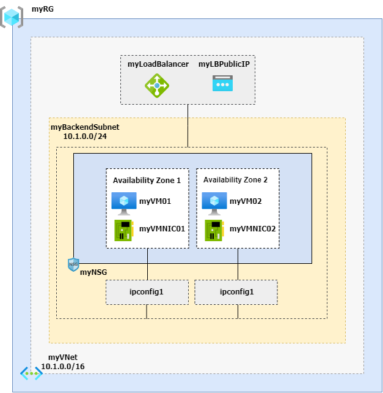

# How to setup a Linux VM with Apache and PHP using cloud-init on Azure behind Load Balancers

> I've wrote two more articles covering the usage of cloud-init. You can see the other two here:
>
> 1. [https://github.com/ricmmartins/linuxvm-cloud-init/](https://github.com/ricmmartins/linuxvm-cloud-init/)
> 2. [https://github.com/ricmmartins/linuxvm-cloud-init-vmss](https://github.com/ricmmartins/linuxvm-cloud-init-vmss)

After my latest article about [How to setup a Linux VM with Apache and PHP using cloud-init on Azure](https://github.com/ricmmartins/linuxvm-cloud-init/), 
I've decided to create the same lab bringing high-availability through Availability Zones and Load Balancing. Then I've created something like this:



✔️ Use the Bash environment in [Azure Cloud Shell](https://docs.microsoft.com/en-us/azure/cloud-shell/quickstart) and let's start!

[](http://shell.azure.com/)

# Create a cloud-init.txt 
```
#cloud-config
package_upgrade: true
packages:
  - apache2
  - php
  - libapache2-mod-php
  - git

runcmd:
  - cd "/usr/share" && git clone https://github.com/ricmmartins/simple-php-app.git
  - mv /var/www/html /var/www/html-bkp
  - ln -s /usr/share/simple-php-app/ /var/www/html
```
## Create a resource group
```
az group create \
    --name myRG \
    --location eastus
```
## Create a virtual network
```
az network vnet create \
    --resource-group myRG \
    --location eastus \
    --name myVNet \
    --address-prefixes 10.1.0.0/16 \
    --subnet-name myBackendSubnet \
    --subnet-prefixes 10.1.0.0/24
```
## Create a network security group    
```
az network nsg create \
    --resource-group myRG \
    --name myNSG
```
## Create a network security group rule
```
az network nsg rule create \
    --resource-group myRG \
    --nsg-name myNSG \
    --name myNSGRuleHTTP \
    --protocol '*' \
    --direction inbound \
    --source-address-prefix '*' \
    --source-port-range '*' \
    --destination-address-prefix '*' \
    --destination-port-range 80 \
    --access allow \
    --priority 200
```
## Create network interfaces for the virtual machines
```
array=(myNicVM01 myNicVM02)
  for vmnic in "${array[@]}"
  do
    az network nic create \
        --resource-group myRG \
        --name $vmnic \
        --vnet-name myVNet \
        --subnet myBackEndSubnet \
        --network-security-group myNSG
  done
```
## Create virtual machine 01
```
az vm create \
    --resource-group myRG \
    --name myVM01 \
    --nics myNicVM01 \
    --image UbuntuLTS \
    --admin-username azureuser \
    --custom-data cloud-init.txt \
    --generate-ssh-keys \
    --zone 1 \
    --no-wait
```
## Create virtual machine 02
```
az vm create \
    --resource-group myRG \
    --name myVM02 \
    --nics myNicVM02 \
    --image UbuntuLTS \
    --admin-username azureuser \
    --custom-data cloud-init.txt \
    --generate-ssh-keys \
    --zone 2 \
    --no-wait
```
## Create a public IP address for the Load Balancer
```
az network public-ip create \
    --resource-group myRG \
    --name myLBPublicIP \
    --sku Standard
```
## Create standard load balancer
```
az network lb create \
    --resource-group myRG \
    --name myLoadBalancer \
    --sku Standard \
    --public-ip-address myLBPublicIP \
    --frontend-ip-name myFrontEnd \
    --backend-pool-name myBackEndPool
```
## Create the health probe
```
az network lb probe create \
    --resource-group myRG \
    --lb-name myLoadBalancer \
    --name myHealthProbe \
    --protocol tcp \
    --port 80
```
## Create the load balancer rule
```
az network lb rule create \
    --resource-group myRG \
    --lb-name myLoadBalancer \
    --name myHTTPRule \
    --protocol tcp \
    --frontend-port 80 \
    --backend-port 80 \
    --frontend-ip-name myFrontEnd \
    --backend-pool-name myBackEndPool \
    --probe-name myHealthProbe \
    --disable-outbound-snat true \
    --idle-timeout 15 \
    --enable-tcp-reset true
```
## Add virtual machines to load balancer backend pool
```
array=(myNicVM01 myNicVM02)
  for vmnic in "${array[@]}"
  do
    az network nic ip-config address-pool add \
     --address-pool myBackendPool \
     --ip-config-name ipconfig1 \
     --nic-name $vmnic \
     --resource-group myRG \
     --lb-name myLoadBalancer
  done
```
## Create outbound rule configuration

### Public IP
```
az network public-ip create \
    --resource-group myRG \
    --name myPublicIPOutbound \
    --sku Standard
```
### Public IP Prefix
```
az network public-ip prefix create \
    --resource-group myRG \
    --name myPublicIPPrefixOutbound \
    --length 28
```
## Create outbound frontend IP configuration

### Public IP
```
az network lb frontend-ip create \
    --resource-group myRG \
    --name myFrontEndOutbound \
    --lb-name myLoadBalancer \
    --public-ip-address myPublicIPOutbound
```
### Public IP Prefix
```
az network lb frontend-ip create \
    --resource-group myRG \
    --name myFrontEndOutbound \
    --lb-name myLoadBalancer \
    --public-ip-prefix myPublicIPPrefixOutbound
```
## Create outbound pool
```
az network lb address-pool create \
    --resource-group myRG \
    --lb-name myLoadBalancer \
    --name myBackendPoolOutbound
```
## Create outbound rule
```
az network lb outbound-rule create \
    --resource-group myRG \
    --lb-name myLoadBalancer \
    --name myOutboundRule \
    --frontend-ip-configs myFrontEndOutbound \
    --protocol All \
    --idle-timeout 15 \
    --outbound-ports 10000 \
    --address-pool myBackEndPoolOutbound
```
## Add virtual machines to outbound pool
```
array=(myNicVM01 myNicVM02)
  for vmnic in "${array[@]}"
  do
    az network nic ip-config address-pool add \
     --address-pool myBackendPoolOutbound \
     --ip-config-name ipconfig1 \
     --nic-name $vmnic \
     --resource-group myRG \
     --lb-name myLoadBalancer
  done
```
## Test the load balancer
```
az network public-ip show \
    --resource-group myRG \
    --name myLBPublicIP \
    --query ipAddress \
    --output tsv
```
## Access using the myLBPublicIP

Open your browser pointing to the Public IP of the Load Balancer and you will be able to see the balancing rule in action.

Reference: [https://docs.microsoft.com/en-us/azure/load-balancer/quickstart-load-balancer-standard-public-cli](https://docs.microsoft.com/en-us/azure/load-balancer/quickstart-load-balancer-standard-public-cli)
